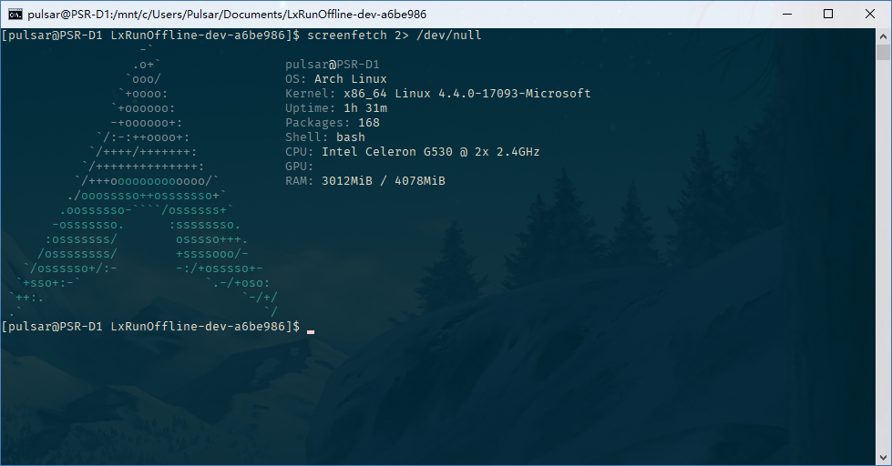

前段时间重装系统之后我就一直在 WSL 内开发。Ubuntu 因为我不喜欢所以直接放弃（？？？），所以就一直在用 openSUSE。然而现在越用越感觉 zypper 的下载源坑爹……于是在 GitHub 上一阵搜索之后，我终于找到了这个神器：[LxRunOffline](https://github.com/DDoSolitary/LxRunOffline)。于是我毅然卸载了 openSUSE，开始尝试安装 Arch Linux……

> 2018-07-25 修改，原文见 [GitHub](https://github.com/refparo/blog/blob/6c9bc90ae4f50cc55efcf146908c614f8a07f677/source/_posts/use-lxrunoffline-to-install-arch-linux.md)

<!-- more -->

## 准备工作

0. 本文假设你已经有一些 Arch Linux 使用经验；
1. 你需要一个 64 位的 Windows 10 1803 版本系统；
2. 启用*适用于 Linux 的 Windows 子系统*功能；（不开这个还想用 WSL？）
3. 下载 [LxRunOffline](https://github.com/DDoSolitary/LxRunOffline)，解压到任意位置；
4. 在 [清华大学镜像站](https://mirrors.tuna.tsinghua.edu.cn/archlinux/iso/latest/) 下载 `archlinux-bootstrap-<日期>-x86_64.tar.gz`。

## 安装 rootfs

在 LxRunOffline 目录下打开 CMD 或 PowerShell，输入

```plain
> .\LxRunOffline.exe install -n <用于向 Windows 注册的系统名> -f <到 rootfs 文件的路径> -d <安装到的目录> -r root.x86_64
```

LxRunOffline 可能会要求重启，那么重启之后再次输入上述命令。LxRunOffline 会把系统安装到指定的目录。正常安装完成后 LxRunOffline 不会有任何输出（真是遵循 UNIX 哲学）。然后输入：

```plain
> .\LxRunOffline.exe set-default -n <之前输入的系统名>
```

把刚刚安装的 Arch 设为默认，就可以输入 `wsl` 启动 Arch 了。

## 安装系统

首先删除 `/etc/resolv.conf`，退出 WSL 再重新进入使 Windows 自动生成这个文件。然后 `cat /etc/pacman.d/mirrorlist` 选择一个镜像服务器，`echo 'Server = <你选择的镜像服务器> >> /etc/pacman.d/mirrorlist'`。（因为这时 Arch Linux 内还没有安装任何编辑器。）

然后安装基础软件：

```plain
# pacman-key --init
# pacman-key --populate archlinux
# pacman -Syyu base base-devel
```

执行第三个命令时，Pacman 会询问需要安装哪些包，此时应选择不安装 `base` 组内的 `linux` 包和 `base-devel` 组内的 `fakeroot` 包。前者是因为 WSL 中 Linux 内核由 Windows 提供，所以不需要安装；后者的原因见[此](https://github.com/Microsoft/BashOnWindows/issues/2465)。

这里建议

```plain
rm /etc/pacman.d/mirrorlist
mv /etc/pacman.d/mirrorlist.pacnew /etc/pacman.d/mirrorlist
```

然后再用 vi 或者 nano 重新编辑 `/etc/pacman.d/mirrorlist`。

然后设置语言和时间：使用 vi 或 nano 编辑 `/etc/locale.gen`，取消注释需要使用的语言（一般是 `en_US.UTF-8 UTF-8` 和 `zh_CN.UTF-8 UTF-8`），输入 `locale-gen` 生成语言文件。输入 `ln -sf /usr/share/zoneinfo/<区域>/<子区域> /etc/localtime` 来设置时区，如我的是：

```plain
# ln -sf /usr/share/zoneinfo/Asia/Shanghai /etc/localtime
```

接下来设置用户：

```plain
# useradd -m -G wheel -s /bin/bash <用户名>
# passwd root
# passwd <用户名>
```

输入 `visudo`，按需要设置 sudo 权限。按 [这里](https://www.archlinuxcn.org/archlinux-cn-repo-and-mirror/) 的说明添加 `archlinuxcn` 软件源，安装 `fakeroot-tcp` 包。

接下来输入 `id -u <用户名>` 查看 UID，然后退出 Bash，输入

```plain
> .\LxRunOffline.exe config-uid -n <之前输入的系统名> -v <UID>
```

设置默认用户。此时建议打开任务管理器检查是否有未关闭的 WSL 进程。把 WSL 进程全部停止，然后打开 Bash，系统就会默认以你的用户登录了。



到这里为止，Arch Linux 就安装完成了。（撒花🎉~）此时系统内还有一些无用的用于安装系统的软件，强迫症可以输入以下命令卸载它们：

```plain
$ sudo pacman -R arch-install-scripts
```
