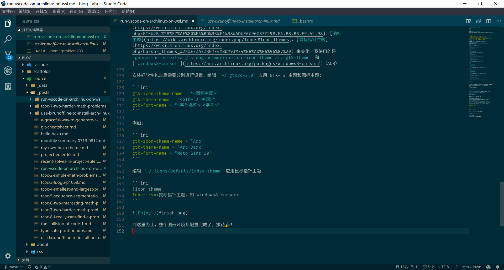

上次我们 [用 LxRunOffline 安装了 Arch Linux](/research/use-lxrunoffline-to-install-arch-linux/)，下一步就要在 WSL 之上构建开发环境了。开发环境的一个很重要的部分就是代码编辑器（或者 IDE），这里就要在 WSL 上安装运行 [VSCode](https://code.visualstudio.com/)。

<!-- more -->

## 准备工作

0. 本文假设你已经有基本的 Arch Linux 使用经验；
1. 你需要在 WSL 上安装好 Arch Linux，并配置了 [Arch Linux 中文社区仓库](https://www.archlinuxcn.org/archlinux-cn-repo-and-mirror/)；
2. 安装 [VcXsrv](https://sourceforge.net/projects/vcxsrv/)。（虽然 VcXsrv 有个导致 VSCode 花屏的 bug，但是我不喜欢那个夹带了一堆我用不到的功能的 [MobaXterm](https://mobaxterm.mobatek.net/)，所以就还是用 VcXsrv 了。这个 bug 的解决方案是：当花屏时，使用 `Ctrl + Shift + P` 输入 reload 回车重新加载窗口。）

## 安装字体

安装你喜欢的 [字体](https://wiki.archlinux.org/index.php/Fonts_%28%E7%AE%80%E4%BD%93%E4%B8%AD%E6%96%87%29)。我的选择是 `noto-fonts noto-fonts-cjk noto-fonts-emoji otf-fira-code`。

安装字体后需要设置默认字体。编辑 `~/.config/fontconfig/fonts.conf`：

```xml
<?xml version="1.0"?>
<!DOCTYPE fontconfig SYSTEM "fonts.dtd">
<fontconfig>

  <match target="font">
    <edit name="embeddedbitmap" mode="assign">
      <bool>false</bool>
    </edit>
  </match>

  <match>
    <test qual="any" name="family">
      <string>serif</string>
    </test>
    <edit name="family" mode="prepend" binding="strong">
      <string>你喜欢的英文衬线字体，如 Noto Serif</string>
    </edit>
  </match>
  <match target="pattern">
    <test qual="any" name="family">
      <string>sans-serif</string>
    </test>
    <edit name="family" mode="prepend" binding="strong">
      <string>你喜欢的英文非衬线字体，如 Noto Sans</string>
    </edit>
  </match>
  <match target="pattern">
    <test qual="any" name="family">
      <string>monospace</string>
    </test>
    <edit name="family" mode="prepend" binding="strong">
      <string>你喜欢的等宽字体，如 Fira Code</string>
    </edit>
  </match>

  <match>
    <test name="lang" compare="contains">
      <string>zh</string>
    </test>
    <test name="family">
      <string>serif</string>
    </test>
    <edit name="family" mode="prepend">
      <string>你喜欢的中文衬线字体，如 Noto Serif CJK SC</string>
    </edit>
  </match>
  <match>
    <test name="lang" compare="contains">
      <string>zh</string>
    </test>
    <test name="family">
      <string>sans-serif</string>
    </test>
    <edit name="family" mode="prepend">
      <string>你喜欢的中文非衬线字体，如 Noto Sans CJK SC</string>
    </edit>
  </match>
  <match>
    <test name="lang" compare="contains">
      <string>zh</string>
    </test>
    <test name="family">
      <string>monospace</string>
    </test>
    <edit name="family" mode="prepend">
      <string>你喜欢的中文等宽字体，如 Noto Sans Mono CJK SC</string>
    </edit>
  </match>

</fontconfig>
```

## 安装 VSCode

安装 `visual-studio-code`。使用 XLaunch 启动 VcXsrv，在倒数第二步勾选“Native openGL”。这里还建议勾选“Clipboard”并取消勾选“Primary selection”以获得最佳体验。（如果你担心每次都要手动勾选太麻烦的话，在最后一步点击“Save configuration”导出设置，以后就可以直接双击打开导出的设置运行 VcXsrv 了。）最后设置环境变量，在 `~/.bashrc` 内添加以下内容：

```bash
export DISPLAY=localhost:0.0
export LIBGL_ALWAYS_INDIRECT=1
```

重启 BASH，然后就可以执行 `code` 运行 VSCode 了。

## 中文输入

WSL 内的输入与 Windows 的输入法并不通用，需要在 WSL 内单独安装输入法。安装 `fcitx fcitx-gtk2 fcitx-configtool`，然后执行 `fcitx` 即可启动输入法。在 fcitx 启动后运行 `fcitx-configtool` 进行设置。在 `~/.bashrc` 内设置环境变量：

```bash
export GTK_IM_MODULE=fcitx
export QT_IM_MODULE=fcitx
export XMODIFIERS=@im=fcitx
```

重启 BASH，运行 `code`，就可以使用中文输入了。

## 美化主题

系统默认的外观非常丑陋。你可以安装自己的 [GTK+ 2 主题](https://wiki.archlinux.org/index.php/GTK%2B_%28%E7%AE%80%E4%BD%93%E4%B8%AD%E6%96%87%29#.E4.B8.BB.E9.A2.98)、[图标主题](https://wiki.archlinux.org/index.php/Icons#Icon_themes)、[鼠标指针主题](https://wiki.archlinux.org/index.php/Cursor_themes_%28%E7%AE%80%E4%BD%93%E4%B8%AD%E6%96%87%29) 来美化。我使用的是 `gnome-themes-extra gtk-engine-murrine arc-icon-theme arc-gtk-theme` 和 [`windows8-cursor`](https://aur.archlinux.org/packages/windows8-cursor/)（AUR）。

安装好软件包之后需要分别进行设置。编辑 `~/.gtkrc-2.0` 应用 GTK+ 2 主题和图标主题：

```ini
gtk-icon-theme-name = "<图标主题>"
gtk-theme-name = "<GTK+ 2 主题>"
gtk-font-name = "<字体名称> <字号>"
```

例如：

```ini
gtk-icon-theme-name = "Arc"
gtk-theme-name = "Arc-Dark"
gtk-font-name = "Noto Sans 10"
```

编辑 `~/.icons/default/index.theme` 应用鼠标指针主题：

```ini
[icon theme]
Inherits=<鼠标指针主题，如 Windows8-cursor>
```



到这里为止，整个图形环境都配置完成了。撒花🎉！
